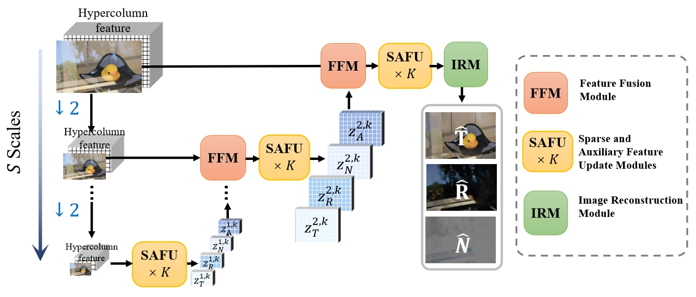
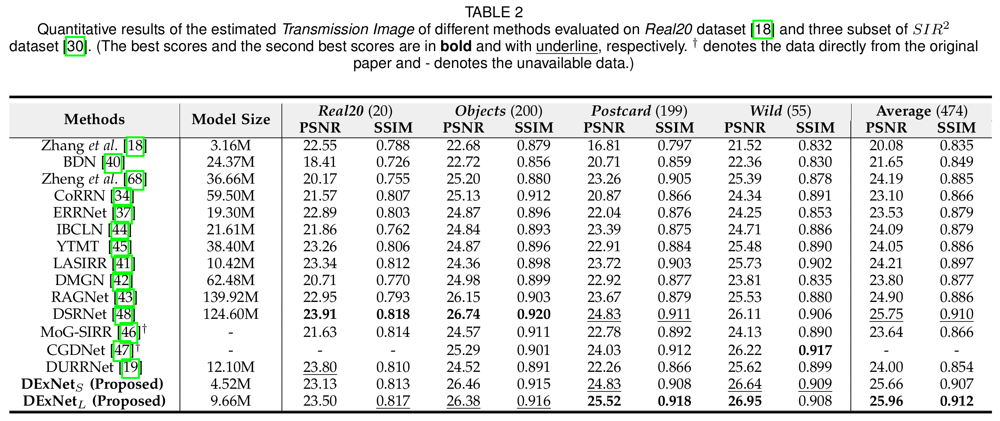

# A Lightweight Deep Exclusion Unfolding Network for Single Image Reflection Removal

Jun-Jie Huang#(jjhuang@nudt.edu.cn), Tianrui Liu#*, Zihan Chen, Xinwang Liu, Meng Wang, and Pier Luigi Dragotti

IEEE Transactions on Pattern Analysis and Machine Intelligence 2025. (#equal contribution, *corresponding author)


### Network Architecture
Overview of the proposed Deep Exclusion unfolding Network (DExNet). DExNet consists of $S$ progressively refinement scales to estimate the transmission and the reflection images in a coarse-to-fine manner.
Each scale contains $K$ stages of Sparse and Auxiliary Feature Update (SAFU) module whose network architecture has one-to-one correspondence to the proposed alternating minimization i-SAFU algorithm and therefore is with high model interpretability. 
For each scale $s>1$, the features from the lower scale are fused with the counterparts of the upper scale with a Feature Fusion Module (FFM).
Finally, the features of the transmission image, the reflection image and the nonlinear residual image are mapped to image domain with an Image Reconstruction Module (IRM). 
Here $\downarrow 2$ denotes bilinear interpolation by a factor of 0.5.



### Data Preparation

#### Training dataset
* 7,643 images from the
  [Pascal VOC dataset](http://host.robots.ox.ac.uk/pascal/VOC/), center-cropped as 224 x 224 slices to synthesize training pairs.
* 90 real-world training pairs provided by [Zhang *et al.*](https://github.com/ceciliavision/perceptual-reflection-removal)

#### Testing dataset
* 45 real-world testing images from [CEILNet dataset](https://github.com/fqnchina/CEILNet).
* 20 real testing pairs provided by [Zhang *et al.*](https://github.com/ceciliavision/perceptual-reflection-removal)
* 454 real testing pairs from [SIR^2 dataset](https://sir2data.github.io/), containing three subsets (i.e., Objects (200), Postcard (199), Wild (55)). 

Download all in one by [Google Drive](https://drive.google.com/file/d/1hFZItZAzAt-LnfNj-2phBRwqplDUasQy/view?usp=sharing) or [百度云](https://pan.baidu.com/s/15zlk5o_-kx3ruKj4KfOvtA?pwd=1231).
### Usage


#### Training 
```python train_sirs.py --inet DExNet --model DExNet_model_sirs --dataset sirs_dataset --loss losses --name DExNet --lambda_vgg 0.1 --lambda_rec 0.2 --lambda_excl 1 --if_align --seed 2018 --batchSize 1 --nEpochs 50 --lr 1e-4 --base_dir "[YOUR DATA DIR]"```
#### Evaluation 
```python eval_sirs.py --inet DExNet --model DExNet_model_sirs --dataset sirs_dataset --name DExNet_test --hyper --if_align --resume --weight_path ./weights/DExNet.pt --base_dir "[YOUR_DATA_DIR]"```


#### Trained weights

Download the trained weights by [Google Drive](https://drive.google.com/file/d/1jkhCvyrQAQZtLaxdDWDkkSOF0NZ12aJp/view?usp=sharing) and drop them into the "weights" dir.

### Quantitative results


#### Visual comparison on SIR^2


### Citation
```
@ARTICLE{Huang2025DExNet,
  author={Huang, Jun-Jie and Liu, Tianrui and Chen, Zihan and Liu, Xinwang and Wang, Meng and Dragotti, Pier Luigi},
  journal={IEEE Transactions on Pattern Analysis and Machine Intelligence}, 
  title={A Lightweight Deep Exclusion Unfolding Network for Single Image Reflection Removal}, 
  year={2025},
  volume={},
  number={},
  pages={1-17},
  doi={10.1109/TPAMI.2025.3548148}
}
